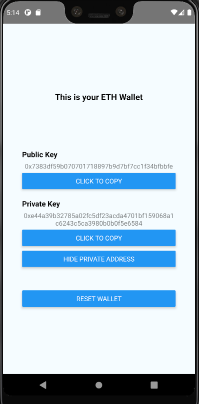

# Ember Assessment

Quick react-native home assignment for Ember Fund. The application simply generates, stores, and displays Etherium public address and private key.

Truthfully, true entropy is not really considered. To my knowledge, a good CSPRNG was used to create the keystore using `react-native-securerandom`. Storage uses `eth-wallet-light` serialization, but since passwords are not well established, storage and private key encryption is not secure. 

For better user experience, a reset wallet button is displayed (and warned user), as well as buttons to copy the address to the device's clipboard, and censor private address display. 

## Environment

* Node v12.17.0
* npm 6.14.4
* React Native 3.2.1
* Android Studio 3.6.3
* Android Emulator: Pixel 3 XL running Android API 30 (R)
* javac 12.0.1, SDK 28 (as noted in React Native docs)

